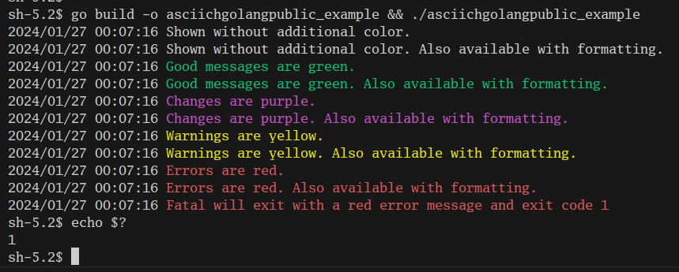

# asciichgolangpublic

This module helps to write infrastructure and/or automation related microservices and CLIs easier and faster.
By providing a lot of convenience functions, sanity checks during runtime and detailed error messages it can be used to write easy to understand software to automate repeatable work.
The focus is on ease of use and developer speed instead of algorithm speed and computer resource efficiency. 


## Provided functionality

* [fluxutils](pkg/fluxutils/): Work with FluxCD.
* [helmutils](pkg/helmutils/): Work with helm and helmcharts.
* [httputils](pkg/httputils/): High level easy to use HTTP client and testserver.
* [kindutils](pkg/kindutils/): Handle KinD/ Kubernetes in Docker.
* [kubernetesutils](pkg/kubernetesutils/): Work with K8s/ Kubernetes.
* [versionutils](pkg/versionutils/): Handle versions.

## Design choices, principles and background information

* Design choices:
	* Function which return an error must not panic.
	* Use `Set` and `Get` functions which allows to validate input and output on every access:
		* Especially when using the provided functions to quickly automatize some stuff validating all inputs as a first step in every function helps to avoid unwanted side effects.
	* While there were a lot of `MustABC` functions introduced this project moves towards removing them except in favor of using `mustutils.Must`
	* `CheckAbc` functions evaluate if `Abc` is given. If given `nil`, otherwise an error is returned.
	* As default there is no log output as silent CLI's are easier to handle if glued together e.g. in Bash scripts. While verbosity was initialy set by `verbose` bool this is projects moves towards replacing it in favor of using `context.Context`. See [`contextutils`](pkg/contextutils)
	* Short cuts and code hacks are not nice but still better than doing things by hand. They are at least a good starting point of what functionality is needed and can be improved over time.
* Releasing:
	* Release often: Every (small) improvement is an improvemnt and will be released as soon as possible.
	* This repository will never reach v1: There will be always be breaking changes if needed to improve the code.
	* Everytime the code base is touched it should look better than before.
* Readability:
	* An end user of this repository should be able to write readable code.
* Background information:
	* Currently this is a one man show.
	* It bases purely on some code I wrote at home in my free time used for automating my personal homelab.


## Logging

To provide easy readable CLI output its recommended to use the provided logging functions:

```golang
package main

import "github.com/asciich/asciichgolangpublic/logging"

func main() {
	logging.LogInfo("Shown without additional color.")
	logging.LogInfof("Shown without additional color. %s", "Also available with formatting.")

	logging.LogGood("Good messages are green.")
	logging.LogGoodf("Good messages are green. %s", "Also available with formatting.")

	logging.LogChanged("Changes are purple.")
	logging.LogChangedf("Changes are purple. %s", "Also available with formatting.")

	logging.LogWarn("Warnings are yellow.")
	logging.LogWarnf("Warnings are yellow. %s", "Also available with formatting.")

	logging.LogError("Errors are red.")
	logging.LogErrorf("Errors are red. %s", "Also available with formatting.")

	logging.LogFatalf("Fatal will exit with a red error message and exit code %d", 1)
}
```

Output produced by this example code:



## Errors

It's recommended to use `TracedError` whenever an error occurs with a custom error message.
Error wrapping by directly passing errors or using the `%w` format string in `TracedErrorf` is supported.
TracedErrors give you a nice debug output including the stack trace in a human readable form compatiple to VSCode (affected sources can directly be opened from Terminal).

Example usage:
```golang
func inThisFunctionSomethingGoesWrong() (err error) {
    return tracederrors.TracedError("This is an error message") // Use TracedErrors when an error occures.
}

err = inThisFunctionSomethingGoesWrong()
tracederrors.Errors().IsTracedError(err) // returns true for all TracedErrors.
tracederrors.Errors().IsTracedError(fmt.Errorf("another error")) // returns false for all non TracedErrors.

err.Error() // includes the error message and the stack trace as human readable text.
```
